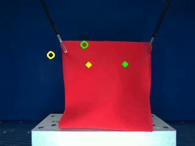
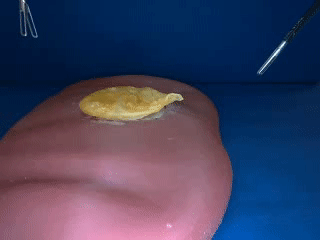
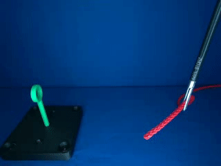
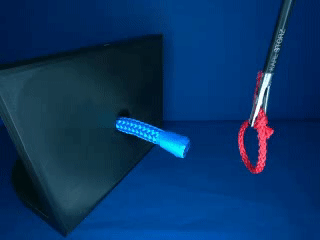

# Movement Primitive Diffusion
Movement Primitive Diffusion (MPD) is a diffusion-based imitation learning method for high-quality robotic motion generation
that focuses on gentle manipulation of deformable objects. [Project Page](https://scheiklp.github.io/movement-primitive-diffusion)

<table style="width: 100%;">
  <tr>
    <td>
      
    </td>
    <td>
      
    </td>
    <td>
      
    </td>
    <td>
      
    </td>
  </tr>
  <tr>
    <td style="font-size: 11px;">
Bimanual Tissue Manipulation
    </td>
    <td style="font-size: 11px;">
Grasp Lift Touch
    </td>
    <td style="font-size: 11px;">
Rope Threading
    </td>
    <td style="font-size: 11px;">
Ligating Loop
    </td>
  </tr>
</table>


## Getting Started
### Installation
1. Clone this repo with all its dependencies (submodules)
```bash
git clone --recurse-submodules git@github.com:ScheiklP/movement-primitive-diffusion.git
```

2. (Highly recommended) Create a new conda environment
```bash
conda create -n mpd python=3.10
conda activate mpd
```

3. Install the `mp_pytorch` package
```bash
pip install -e ./dependencies/MP_PyTorch
```

4. Install the `movement_primitive_diffusion` package
```bash
pip install -e .
```

5. (Optional) To track your experiments with wandb, log into wandb.
```bash
wandb login
```

6. (Optional) Download the [training data](https://zenodo.org/doi/10.5281/zenodo.12625708) used in the paper from Zenodo.

### Running a training
```bash
python scripts/train.py --config-name dummy +experiments/obstacle_avoidance=train_prodmp_transformer
```


## Using This Repository
The code in this repository is not ment to just reproduce the experiments of our paper, but to enable you to use our method on your own imitation learning tasks.
In the following, we want to show you the required steps to train Movement Primitive Diffusion on your own data.


### Add your data
Prepare your training data, where each demonstration is a directory, and each directory contains `.npz` files that are time series you want to use for training.
```bash
.
└── data/
    └── my_task_data/
        ├── demonstration_01/
        │   ├── time_series_a.npz
        │   ├── time_series_b.npz
        │   └── time_series_c.npz
        ├── demonstration_02/
        │   ├── time_series_a.npz
        │   ├── time_series_b.npz
        │   └── time_series_c.npz
        └── ...
```
These time series can be observations (rgb images, joint velocities, force measurements, ...) or actions as long as they have the a leading time dimension (shape: `(T, ...)`).

### Define which values to load and how to preprocess them
You can then add a `./conf/experiments/my_task/dataset_config/dataset.yaml` config to describe which values to load, and if they need any preprocessing.
```yaml
# @package dataset_config
_target_: movement_primitive_diffusion.datasets.trajectory_dataset.SubsequenceTrajectoryDataset
_recursive_: False
subsequence_length: ${eval:'${t_obs}+${t_pred}-1'}
trajectory_dirs: null # set in python code
keys:
  - time_series_a
  - time_series_b
  - time_series_c
dt: 0.1 # <- What is the time difference between each value in the time series?
target_dt: null # <- Optional resampling of your time series
normalize_keys: # <- which of the keys should be normalized? (scaled to an interval)
  - time_series_a
normalize_symmetrically: True # False: normalized to [0, 1] instead of [-1, 1]
standardize_keys: # <- which of the keys should be standardized? (zero mean, std of 1)
  - time_series_b
scaler_values:
    time_series_a:
      min: null # <- will be calculated in the dataset
      max: null
    time_series_b:
      mean: null
      std: null
recalculate_velocities_from_to: # <- if you normalize position values, the velocity values will not match anymore (0 velocity before scaling might not be 0 velocity after scaling)
    - [time_series_a, time_series_c] # <- calculate time_series_c (let's say these are joint velocities) from the normalized values of time_series_a using dt
image_keys: []
image_sizes: []
crop_sizes: []
```

### Define the observations
To define what the agent receives as observations, we have to determine which of the time series are observation values, how we want to encode them, and how the encodings should be aggregated (merged).
For the most basic transformer architecture, we want to just load the values and concatenate them.
As an example: `./conf/experiments/my_task/encoder_config/passthrough.yaml` to just take `time_series_b` as observations.

```yaml
# @package agent_config.encoder_config
_target_: movement_primitive_diffusion.encoder.Encoder
_recursive_: False
t_obs: ${t_obs}
network_configs:
  - observation_key: time_series_b
    feature_size: null # set in python based on dataset
    network_config:
      _target_: movement_primitive_diffusion.networks.layers.PassThrough
aggregator_config:
  _target_: movement_primitive_diffusion.aggregators.concatenate.ConcatenateAggregator
```

### Define the actions
Since we normally do not encode the actions, but just want to produce the actual numerical values, we do not define any encoding, we just define which of the time series should be used as action references.
Let's say `time_series_a` were action values for joint positions, and `time_series_c` are the corresponding joint velocity actions.
The appropriate config `./conf/experiments/my_task/process_batch_config/prodmp.yaml` should look like this:
```yaml
# @package agent_config.process_batch_config
_target_: movement_primitive_diffusion.datasets.process_batch.ProcessBatchProDMP
_recursive_: False
t_obs: ${t_obs}
t_pred: ${t_pred}
relative_action_values: False  # <- can be used to create actions sequences that start with 0 as the first action
action_keys:
  - key: time_series_a
    feature_size: null # set in python based on dataset
initial_values_come_from_action_data: True  # <- if time_series_a.npz stores action values,
# the values are "desired values for time t+1", so the values will be shifted by 1 to get the initial values
initial_position_keys: # <- used by the ProDMP to set the initial values of the action sequence
  - time_series_a
initial_velocity_keys: # <- used by the ProDMP to set the initial values of the action sequence
  - time_series_c
observation_keys: null # set in python based on encoder
```

### Define the training config
Now we can finally define how to train our agent.
We will add a `./conf/experiments/my_task/train_mdp.yaml` config to train MPD on `my_task`.

```yaml
# @package _global_
defaults:
  - dataset_config: dataset
  - /agent_config: prodmp_transformer_agent  # <- this is defined in ./conf/agent_config/prodmp_transformer_agent.yaml
  - process_batch_config: prodmp
  - encoder_config: passthrough
  - override /agent_config/model_config/inner_model_config: prodmp_transformer # <- this is defined in ./conf/agent_config/model_config/inner_model_config/prodmp_transformer.yaml
  - workspace_config: dummy  # <- This will use a dummy workspace that does not contain an environment for evaluation of the trained agent. See below for more information about workspaces.
  - _self_

# Set what should be used to determine if model performance increased in testing in environment
performance_metric: end_point_deviation # can be anything that is returned in the dict of workspace.test_agent(agent) or in epoch_info
performance_direction: min # {min, max}

device: auto  # {auto, cpu, cuda}. auto will select cuda if available, cpu otherwise

t_obs: 3
t_pred: 12
t_act: 12
predict_past: False

train_split: 0.9 # <- use 90% of the data for training and 10% for validation
dataset_fully_on_gpu: True # <- load the whole dataset onto the GPU to speed up training. If that is too much -> set to False (will load into RAM, and only load minibatches to GPU).
trajectory_dir: my_task_data

fixed_split: False # <- can be used to specify a fixed subset of demonstrations to use for training and validation
train_trajectory_dir: null
val_trajectory_dir: null

data_loader_config:
  shuffle: True
  pin_memory: False
  num_workers: 0
  batch_size: 256

epochs: 3000
early_stopping: False
eval_in_env_after_epochs: 9999
num_trajectories_in_env: null
save_distance: 100 # additionally to the best model, save model every n epochs

group_from_overrides: False
name_from_overrides: True
ignore_in_name:
  - group
  - my_task

wandb:
  entity: wandb-user
  project: my_task
  group: movement-primitive-diffusion-experiment
  mode: online # online, offline, disabled
```

### Run the training script
```bash
python scripts/train.py --config-name dummy +experiments/my_task=train_mpd
```
You can find the outputs of the training run in the `wandb` directory.

## A Note on `t_pred` & `action_steps`
In the original [Diffusion Policy paper](https://arxiv.org/abs/2303.04137), `t_pred` is the total number of time steps for which actions are predicted.
Our code slightly deviates from this convention, as `t_pred` is the number of *future* time steps for which actions are predicted.
There is another parameter `predict_past` that controls whether the model should also predict the actions for the time steps from which we draw observations.
The output of the model, in this case, would be `t_pred + t_obs - 1` time steps (overlap of 1 at time 0).
This leads to a slight inconsistency in the Diffusion Policy variant with Convolutional Neural network, as `t_pred` has to be reduced from `12` to `10`, so that the embedding sizes during down- and up-sampling are consistent (rounding issues).

## A Note on Configuration and Hydra
The code heavily uses [hydra](https://hydra.cc/) for configuration.
Most importantly, we use hydra's `instantiate` function to create all the components of our agents, models, etc.
This gives us a lot of flexibility and easy extendability when we want to test new stuff.

For example the `DiffusionAgent` class expects `DictConfig`s that it can use to create a sigma distribution, sampler, and noise scheduler.
```python
class DiffusionAgent(BaseAgent):
    def __init__(
        self,
        sigma_distribution_config: DictConfig,
        sampler_config: DictConfig,
        noise_scheduler_config: DictConfig,
    # ...
    ):
        # ...
        self.sigma_distribution: Distribution = hydra.utils.instantiate(sigma_distribution_config)
        self.sampler: BaseSampler = hydra.utils.instantiate(sampler_config)
        self.noise_scheduler: NoiseScheduler = hydra.utils.instantiate(noise_scheduler_config)
        # ...
```
If we want to use a completely different sampler (e.g. `NovelSampler`), we implement a new class that inherits from `BaseSampler`, add a config file `./conf/agent_config/sampler_config/novel.yaml`:
```yaml
_target_: movement_primitive_diffusion.samplers.novel.NovelSampler
_recursive_: False
```
and can now use it in any of our agents without changes to the `DiffusionAgent`.
This functionality, of course, could have been achieved in multiple different ways, but we feel hydra strikes a very good middle ground between ease of usage and scalability.
For example running many experiments where we want to see the impact of different samplers, we can scale it up through hydra's launcher functionality.
```bash
python3 scripts/train.py --multirun --config-name dummy +seed="range(5)" +experiments/my_env=train_prodmp_transformer agent_config/sampler_config=ddim,euler,novel
```

This will start training runs for training `MPD` on `my_env` with 5 random seeds each for the sampler configs `ddim`, `euler`, and `novel`.
The initial effort of understanding how hydra creates configurations from the hierarchical structure in the `conf` directory is not negligible, but in our experience it pays off.
We strongly encourage you to use a debugger to step through the code to see how the configurations propagate through the code during runtime.

## Evaluation of the Agent in a Gymnasium Environment
### With Evaluation in an Environment
We aim for a high compatibility with environments that follow the [Gymnasium](https://gymnasium.farama.org/) API standard, however you might have to implement a few functions
to use your own environments with our code.
In our code, we assume observations to be dictionaries of torch tensors, that are returned when calling `observation_buffer = env.get_observation_dict()` which is not part of the Gymnasium API standard.
The dictionary should be structured like the output of our `SubsequenceTrajectoryDataset`, and contain the keys defined as `observation_keys`, in the `encoder_config`.
For example for `t_obs=3` and a single observation key `time_series_b`:
```python
{
    "time_series_b": tensor of shape (1, t_obs, feature_size),
}
```

For a full environment implementation example, please have a look at `./trajectory_diffusion/workspaces/obstacle_avoidance/obstacle_avoidance_env.py`.

The training script will create a workspace, and periodically run the `workspace.test_agent(agent)`:
```python
# Get observation dictionaries from the environment
observation_buffer = self.env.get_observation_dict()

# Process the observation buffer to get observations and extra inputs
observation, extra_inputs = agent.process_batch.process_env_observation(observation_buffer)

# Predict the next action sequence
actions = agent.predict(observation, extra_inputs)

# Execute up to t_act actions in the environment
for action in actions[: self.t_act]:
    env_obs, reward, terminated, truncated, info = self.env.step(action)
```

We use the concept of a workspace to abstract most of the code required to implement the logic for agent-environment interaction.
We provide base classes both for a single environment, as well as a vectorized version that runs multiple environments, each in their own subprocess.
For flexibility, you can inherit from these base classes to add extra features for logging, resetting, etc. based on a callback pattern.
As an example, please have a look at `./trajectory_diffusion/workspaces/obstacle_avoidance/obstacle_avoidance_workspace.py`
and `./trajectory_diffusion/workspaces/obstacle_avoidance/obstacle_avoidance_vector_workspace.py` for basic and vectorized workspaces.

### Without Evaluation in an Environment
If you only want to train a model on a fixed dataset, you can use the `DummyWorkspace` class that will skip periodic evaluation of the trained agent in an environment.
You can use the following `workspace_config` for `hydra`:
```yaml
# @package workspace_config
_target_: movement_primitive_diffusion.workspaces.dummy_workspace.DummyWorkspace
_recursive_: False

env_config:
  scaler_config:
    scaler_values: null
```

## Optional Dependencies

### Deformable Object Manipulation Tasks in SOFA
In our paper "Movement Primitive Diffusion: Learning Gentle Robotic Manipulation of Deformable Objects", we evaluate our model in several deformable object manipulation tasks in [SOFA](https://github.com/sofa-framework/sofa).
To reproduce these experiments, you will have to install `sofa_env` according the instructions in the [sofa_env repository](https://github.com/ScheiklP/sofa_env/tree/main).
The last commit that is verified to work with this repository is `ad6c4d503c435b13daca6c604f90b91027d03834`.
If the current commit on the main branch does not work, try this commit of `sofa_env`.

### Running Experiments on Compute Clusters with SLURM
We heavily use [hydra](https://hydra.cc/) for configuration.
For larger experiments on systems that use [SLURM](https://slurm.schedmd.com/overview.html), we use [clusterduck](https://github.com/ALRhub/clusterduck) to launch the training runs.
To use clusterduck:
```bash
git clone git@github.com:ALRhub/clusterduck.git ./dependencies/clusterduck/
pip install ./dependencies/clusterduck
```
The last commit that is verified to work with this repository is `7e7571b88b2dc9a08002cf45963d53727b94ceeb`.
If the current commit on the main branch does not work, try this commit of `clusterduck`.

## Citing

If you use the project in your work, please consider citing it with:

```bibtex
@article{Scheikl2024MPD,
  author={Scheikl, Paul Maria and Schreiber, Nicolas and Haas, Christoph and Freymuth, Niklas and Neumann, Gerhard and Lioutikov, Rudolf and Mathis-Ullrich, Franziska},
  title={Movement Primitive Diffusion: Learning Gentle Robotic Manipulation of Deformable Objects},
  journal={IEEE Robotics and Automation Letters}, 
  year={2024},
  volume={9},
  number={6},
  pages={5338-5345},
  doi={10.1109/LRA.2024.3382529},
}
```
