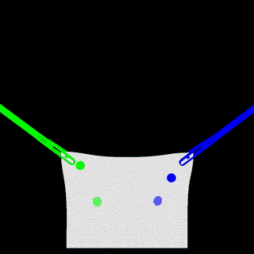
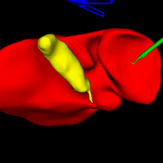
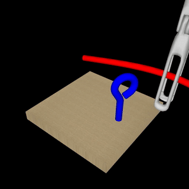
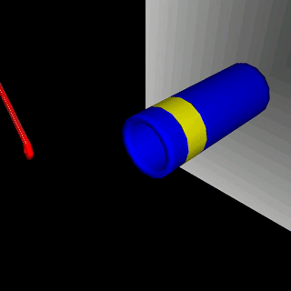
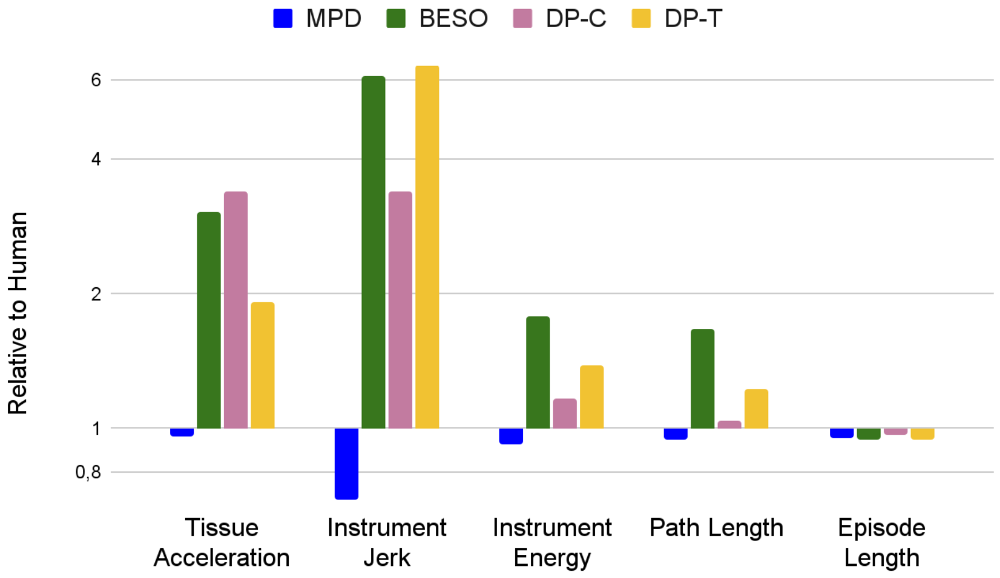
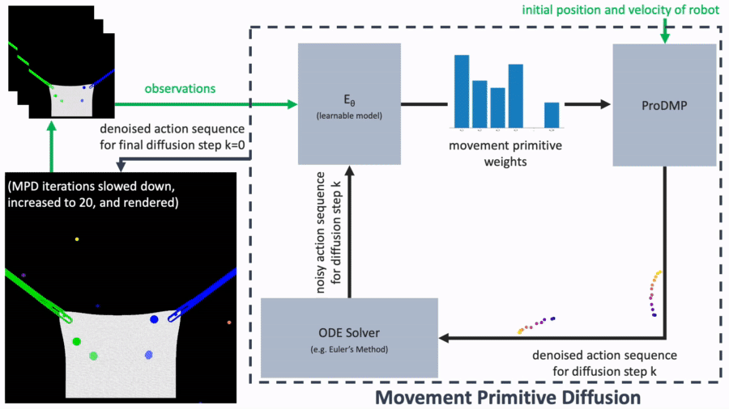

<p style="text-align: justify">
    Policy learning in robot-assisted surgery (RAS) lacks data efficient and versatile methods that exhibit the desired motion quality for delicate surgical interventions.
    To this end, we introduce Movement Primitive Diffusion (MPD), a novel method for imitation learning in RAS that focuses on gentle manipulation of deformable objects.
    The approach combines the versatility of diffusion-based imitation learning (DIL) with the high-quality motion generation capabilities of Probabilistic Dynamic Movement Primitives.
    This combination enables MPD to achieve gentle manipulation of deformable objects, while maintaining data efficiency critical for RAS applications where demonstration data is scarce.
    We evaluate MPD across various simulated and real world robotic tasks on both state and image observations.
    MPD outperforms state-of-the-art DIL methods in success rate, motion quality, and data efficiency.
</p>

<b>TL;DR:</b>
Movement Primitive Diffusion (MPD) is a diffusion-based imitation learning method
for high-quality robotic motion generation that focuses on gentle manipulation of deformable objects.

---

<p style="text-align:center; font-size: 24px; margin-top: 20px; margin-bottom: 20px;">
    <a href="https://arxiv.org/abs/2312.10008"><i class="fas fa-file-pdf"></i> Paper</a> |
    <a href="https://github.com/ScheiklP/movement-primitive-diffusion"><i class="fas fa-code"></i> Code</a>
</p>

---

<table style="width: 100%;">
  <tr>
    <td colspan="4" style="font-size=24px;">
        <b style="font-size: 24px; text-align: center;">
Simulation Tasks
        </b>
    </td>
  </tr>
  <tr>
    <td>
      
    </td>
    <td>
      
    </td>
    <td>
      
    </td>
    <td>
      
    </td>
  </tr>
  <tr>
    <td colspan="4" style="font-size=24px;">
        <b style="font-size: 24px; text-align: center;">
Real-World Tasks
        </b>
    </td>
  </tr>
  <tr>
    <td>
      
    </td>
    <td>
      
    </td>
    <td>
      
    </td>
    <td>
      
    </td>
  </tr>
  <tr>
    <td style="font-size: 11px;">
Bimanual Tissue Manipulation
    </td>
    <td style="font-size: 11px;">
Grasp Lift Touch
    </td>
    <td style="font-size: 11px;">
Rope Threading
    </td>
    <td style="font-size: 11px;">
Ligating Loop
    </td>
  </tr>
  <tr>
    <td>
Indirect deformable object manipulation, and concurrent bimanual coordination.
    </td>
    <td>
Grasping, direct deformable object manipulation, and sequential bimanual coordination.
    </td>
    <td>
Precision navigation of surgical thread and spatial reasoning.
    </td>
    <td>
Precision navigation of a deformable instrument to constrict a deformable object.
    </td>
  </tr>
</table>


---

<p style="font-size: 24px; margin-top: 20px; margin-bottom: 14px;">
<b>
Motion Quality Metrics
</b>
</p>

<p style="margin-top: 10px; margin-bottom: 20px; text-align: center">
Baselines: <a href="https://openreview.net/forum?id=nvtxqMGpn1">BESO</a> | <a href="https://diffusion-policy.cs.columbia.edu/">DP-C</a> | <a href="https://diffusion-policy.cs.columbia.edu/">DP-T</a>
</p>

---

<p style="font-size: 24px; margin-top: 20px; margin-bottom: 14px;">
<b>
Architectural Overview
</b>
</p>


<p style="margin-top: 10px; margin-bottom: 20px; text-align: center">
MPD iteratively refines a noisy sequence of actions into a denoised vector of weights for a Probabilistic Dynamic Movement Primitive (ProDMP).
The final weight vector is decoded into a smooth, high-frequency motion trajectory with guaranteed initial values for position and velocity.
</p>

---

<p style="font-size: 24px; margin-top: 20px; margin-bottom: 14px;">
<b>
Multi-Modal Behaviors
</b>
</p>

<table>
  <tr>
    <td style="width: 50%;">
      
    </td>
    <td style="vertical-align: middle; padding-left:20px; width: 50%;">
MPD is able to represent multi-modal behaviors for the same task, generating versatile motions.
The mode of the generated motion depends on the initial random sample that is refined by MPD.
    </td>
  </tr>
</table>

---

<p style="font-size: 24px; margin-top: 20px; margin-bottom: 14px;">
<b>
BibTeX
</b>
</p>
```bibtex
@article{scheikl2024mpd,
  title = {Movement Primitive Diffusion: Learning Gentle Robotic Manipulation of Deformable Objects},
  author = {Scheikl, Paul Maria and Schreiber, Nicolas and Haas, Christoph and Freymuth, Niklas and Neumann, Gerhard and Lioutikov, Rudolf and {Mathis-Ullrich}, Franziska},
  year = {2024},
  journal = {IEEE Robotics and Automation Letters},
}
```

---

<p style="font-size: 24px; margin-top: 20px; margin-bottom: 14px;">
<b>
Acknowledgements
</b>
</p>
The work was supported by the Erlangen National High Performance Computing Center
funded by the German Research Foundation (DFG),
the HoreKa supercomputer funded by the Ministry of Science, Research and the Arts Baden-Württemberg
and by the Federal Ministry of Education and Research, and the DFG – 448648559.
